💰 CashCraft – Personal Budget Tracker

CashCraft is an intelligent personal finance management platform designed to help users take control of their income, expenses, and savings goals. Built as a full-featured budget tracker, it provides real-time insights, visual dashboards, and intuitive interfaces for effective financial planning.

Whether you're managing daily expenses or working toward savings goals, CashCraft makes budgeting simple, smart, and visually engaging.

🚀 Features

💸 Income & Expense Tracking – Log and categorize all transactions effortlessly.
📊 Visual Dashboards – Get insights into your spending with interactive charts.
🎯 Savings Goals – Set, monitor, and achieve financial goals with progress indicators.
📅 Budget Planner – Create personalized budgets and receive alerts for overspending.
📈 Spending Analysis – Breakdown of categories with monthly trends and analytics.
👤 User Accounts – Secure login, registration, and personal finance data storage.
🧭 Responsive Dashboard – Tailored design for desktop and mobile users.
🌙 Modern UI/UX – Clean, vibrant, and user-friendly interface built with Tailwind CSS.

🛠️ Tech Stack

Backend: Django (Python)

Frontend: HTML, Tailwind CSS, JavaScript

Database: SQLite (Django ORM)

Tools & Libraries: Chart.js, Django Authentication System
---

## 📸 Screenshots

> Key screens from the CASH CRAFT user experience:

### 🏠 Homepage
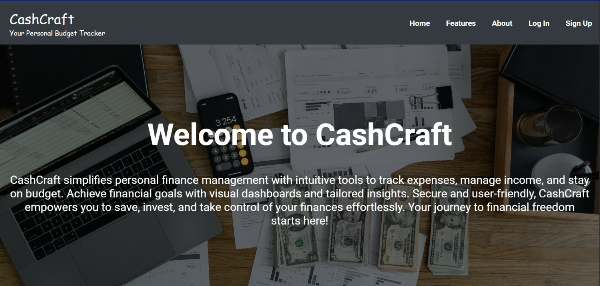  
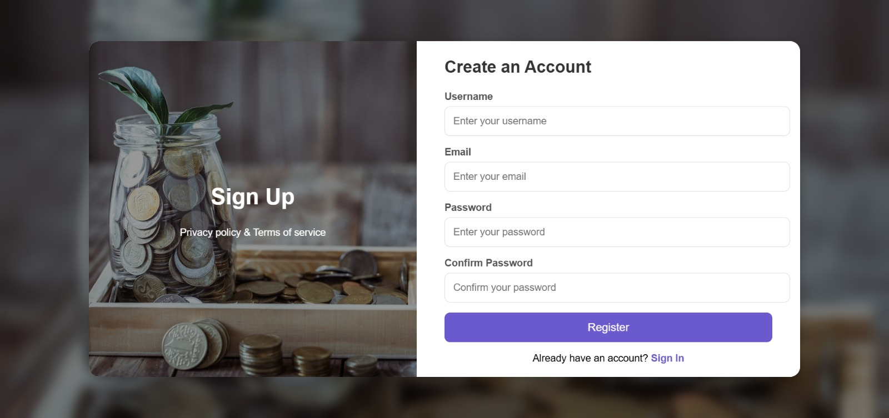  
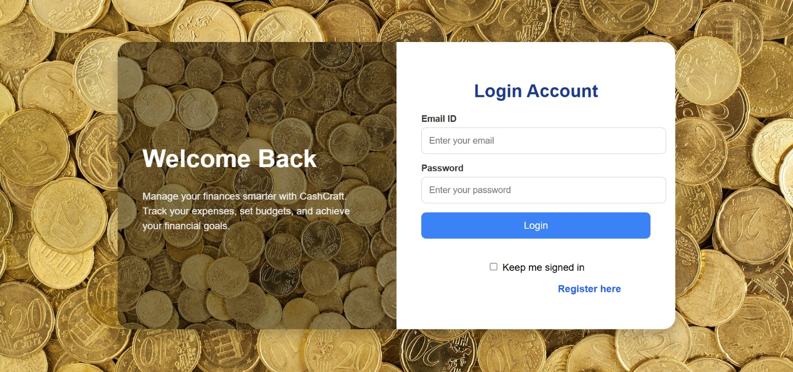  
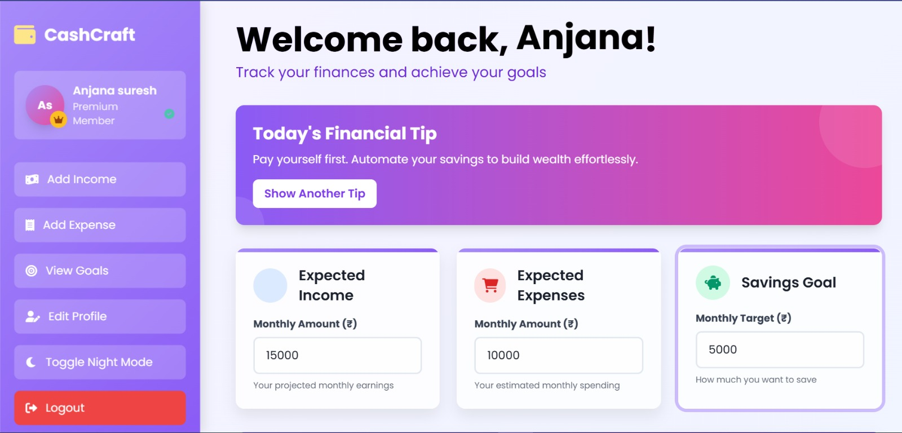  
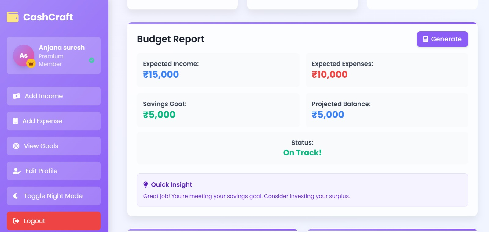  
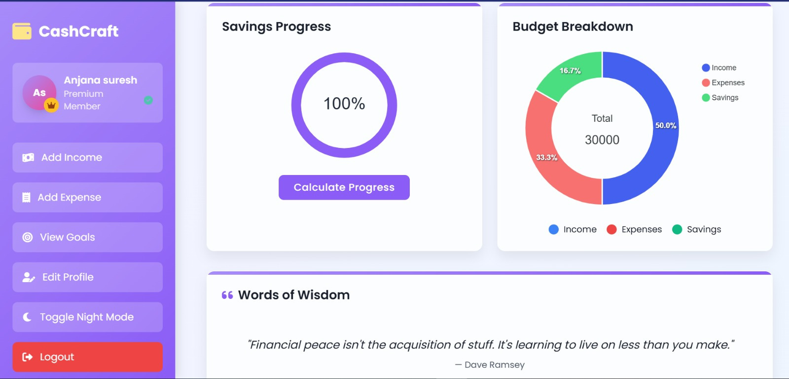  
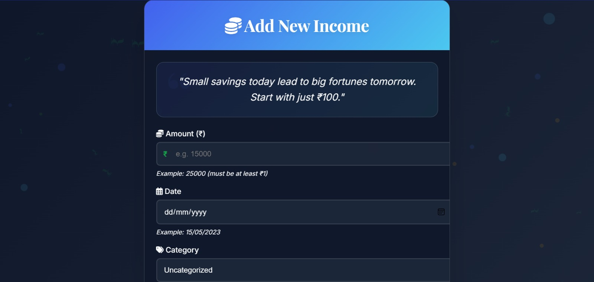  
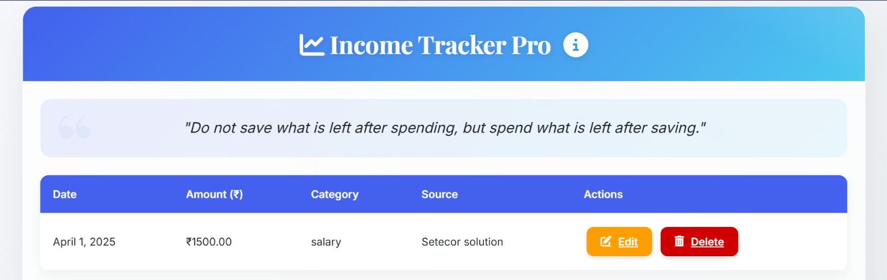  
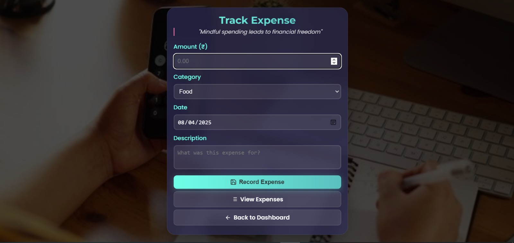  
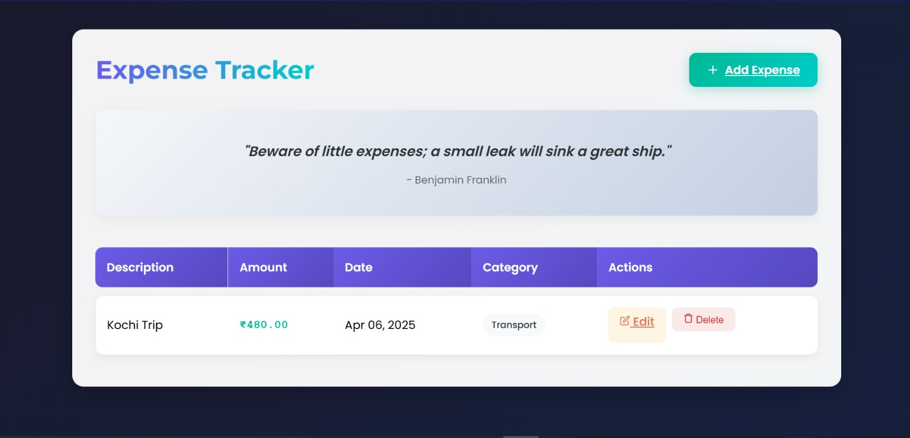  
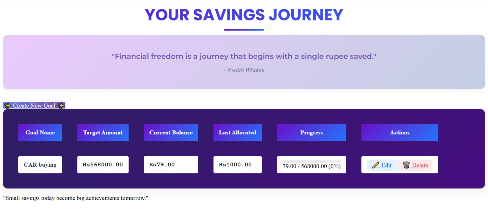  

---
